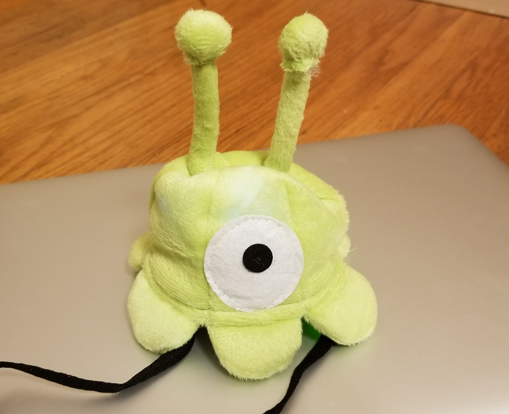
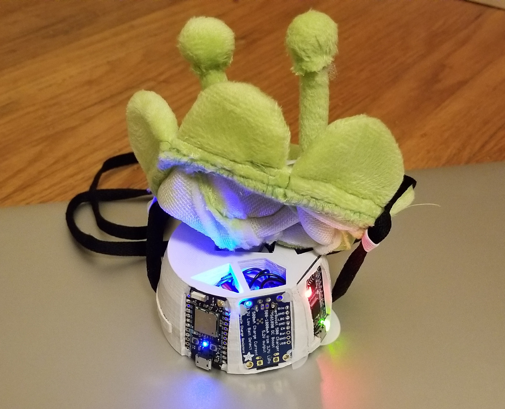
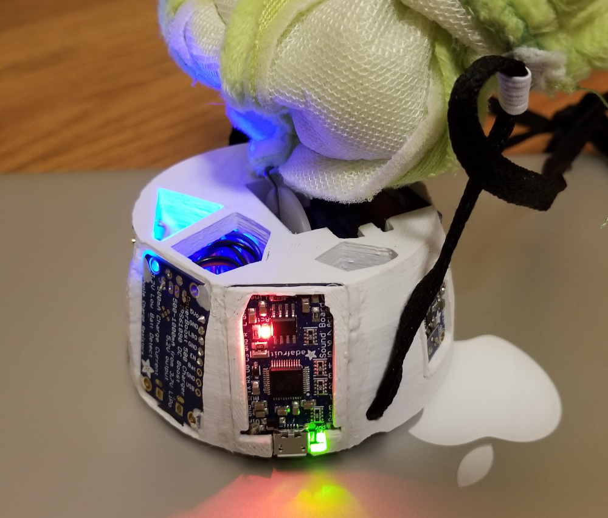
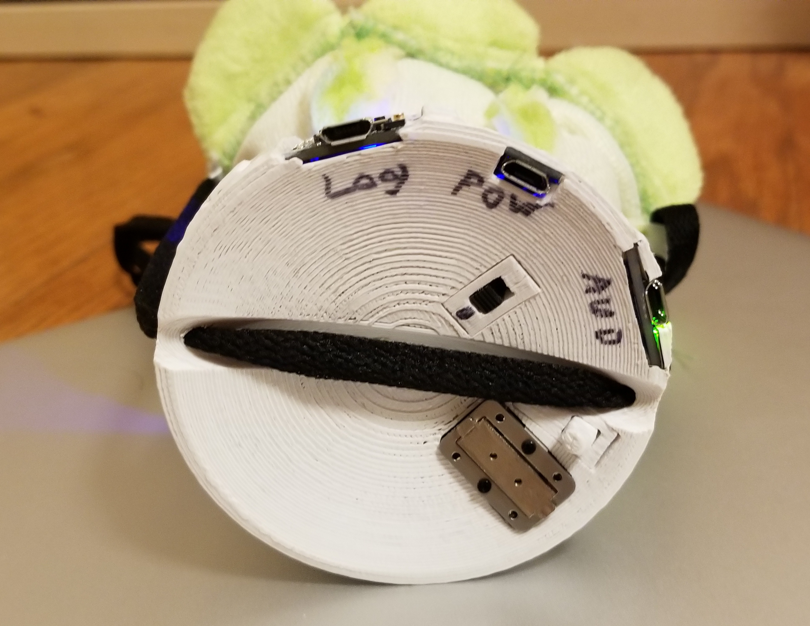

Headslug halloween hat
======================

It's a small hat based on Futurama's [brain slug](https://futurama.fandom.com/wiki/Brain_Slug) - it can talk and move.

Overall that was a fun project for Halloween 2019, hopefully you will find something useful here.

## Requirements

* 3D Printer - to print the internal carcass
* Brainslug skin - you can buy it somewhere or make yourself (it should be soft and empty inside)
* Soldering iron, wires & stuff - there will be some soldering, so be prepared
* Components:
    * Control board - [Particle Photon](https://store.particle.io/collections/wifi/products/photon)
    * Power control/charger - [Adafruit Powerboost 500](https://www.adafruit.com/product/1944)
    * 2W amplifier - [Adafruit Mono 2.5W](https://www.adafruit.com/product/2130)
    * Audio board - [Adafruit Audio FX Mini](https://www.adafruit.com/product/2342)
    * Bone conductor - [Bone Conductor Transducer](https://www.adafruit.com/product/1674)
    * Continuous Rotation Micro Servo - [FS90R](https://www.adafruit.com/product/2442)
    * LiPo battery (check polarity) - [3.7V 1200mAh Lipo battery with JST Connector](https://www.amazon.com/gp/product/B07BTQFWGD/)
    * Small Power switch - [SPDT Vertical Micro Slide Switch](https://www.amazon.com/gp/product/B07DWWJPF8/)
    * Micro switch - [SPDT Limit Micro Switch Long Hinge Lever](https://www.amazon.com/gp/product/B073TYWX86/)
    * Hidden switch - [SPDT Miniature Switch Long Roller Lever](https://www.amazon.com/gp/product/B07CGKJG1Z/)

Of course not all the components are required and you can replace some of them, but check that the 3d model
or logic is adjusted properly. For example you can replace bone transducer with a small speaker or photon with
some other board...

## Features

* Detecting off/on head
* Movement like the real brain slug
* Talking directly to your head
* Hidden button to change mood and silent mode

## Ways for improvement

Actually I thought to add one more minigame - find the buddy, but had no time for that... So a couple of headslugs
can find each other using WiFi - AP is already enabled and scanning, so if you want - you can add some logic and
the game will be activated.
